# CLOUD COMPUTING
Designing architecture for cloud system and build the environment to store the resource and provide server to do the process in google cloud service. Then create a database with MySQL for organizes, integrates, and control the output from the process in server and create Rest Api with Laravel framework to simplifying communication between database and android to serve the data output 

## Service
- Google Storage

Google storage is used to store all resource data either input and output. We create 2 bucket and using the url to call the object from storage.
- AI Platform Notebook

AI Platform Notebook is used as a server for running the machine learning process. It will call the model and doing image identification process with ML program.
- Compute Instances

Compute Instance is used to run MADANI server application. We used two instances for api server and for machine learning program.
- MySql

We used MySql database to organize and control the output from machine learning process.
- Framework Laravel
We used Laravel to build rest API service to connect database and android as a client. It's a comprehensive framework and logically structured.

## Process Production

1. Designing architecture cloud

    - GCP Architecture

        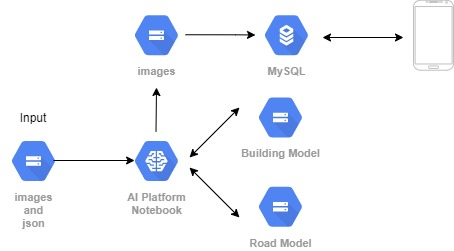

2. Setup Environment

    - Create Bucket
    
        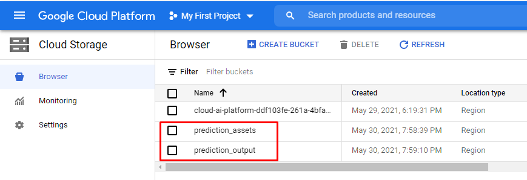
    - Create VM Instances for API

        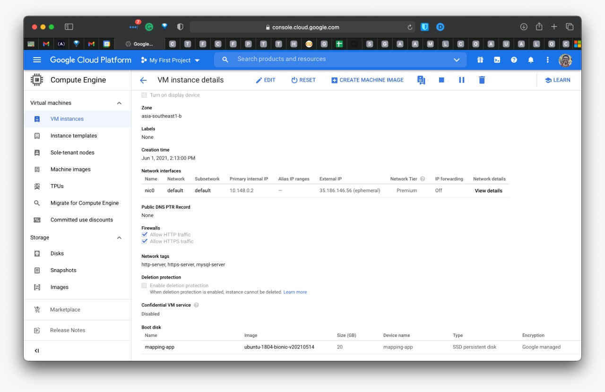

    - Create Notebook AI
        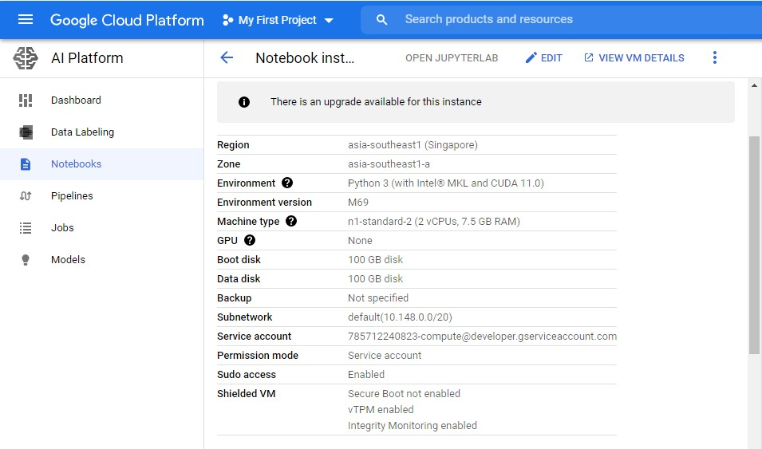

3. Create Database

    - DB Eaver
        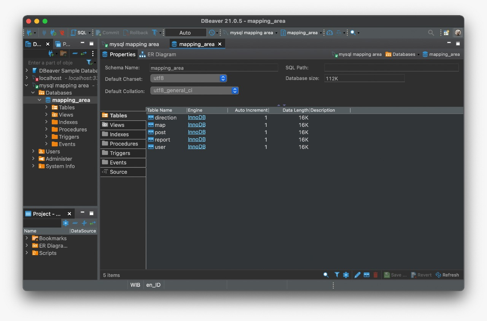

    - Database Schema
        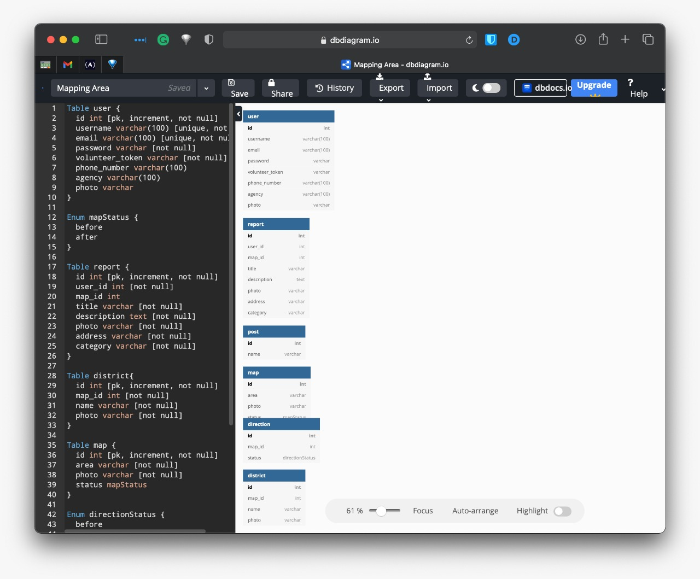

4. Build Rest API

    - Models
        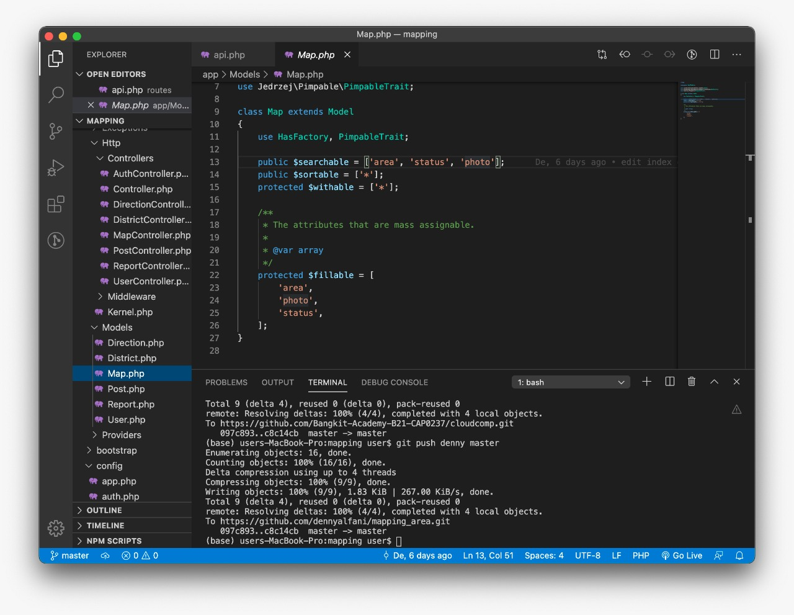

    - Controller
        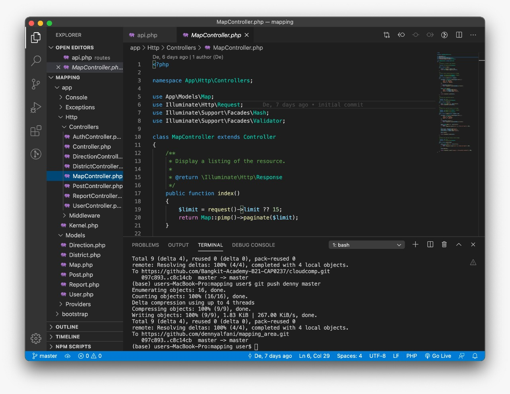

    - api.php
        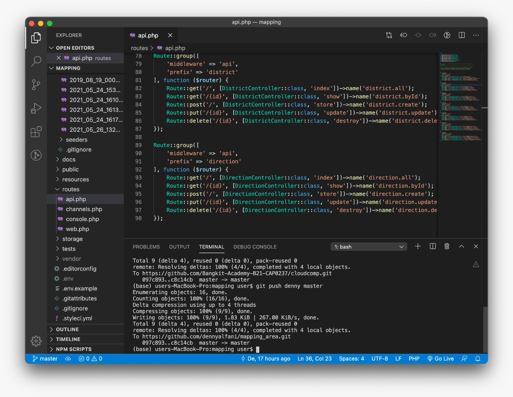

    - POSTMAN
        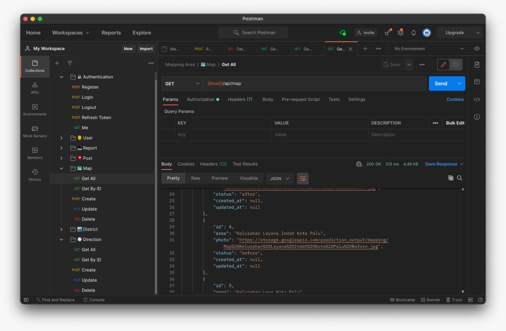

    - API Server
        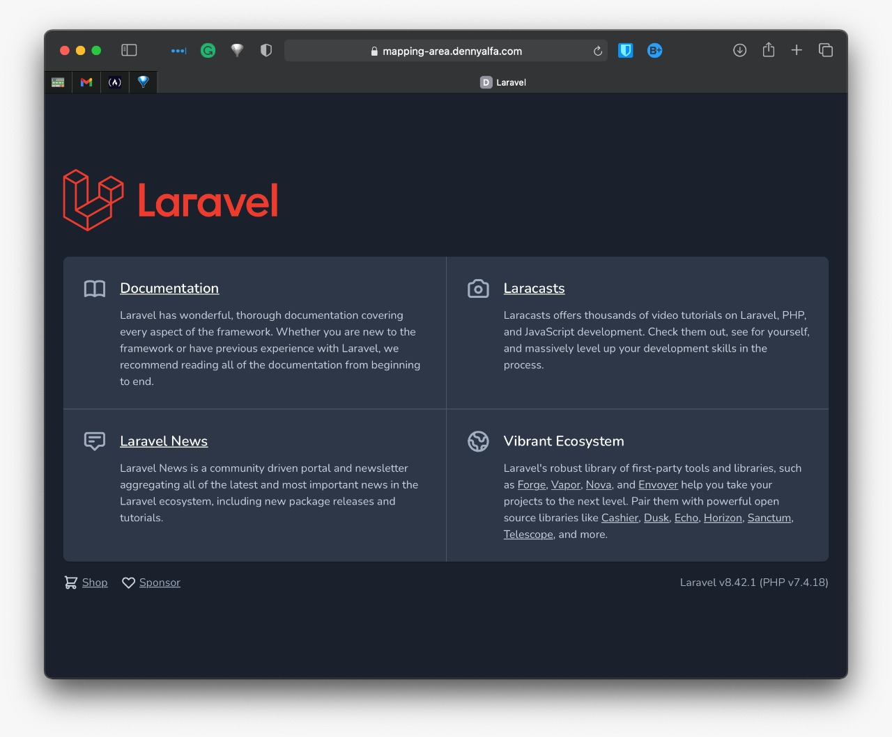

5. Migrating all resource to cloud

