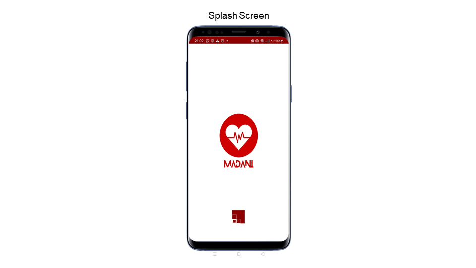
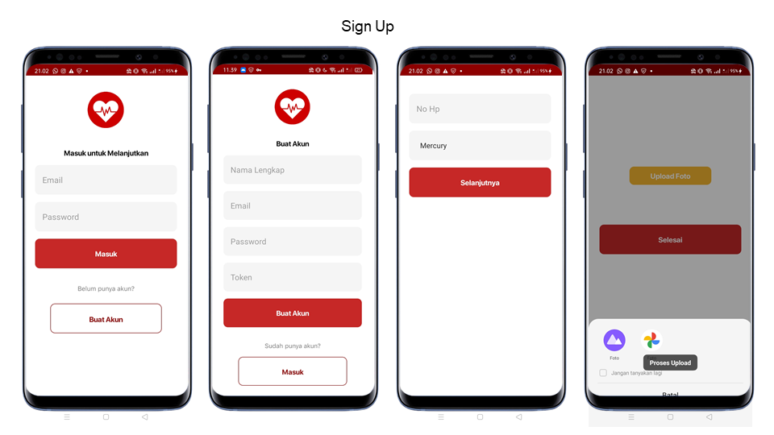
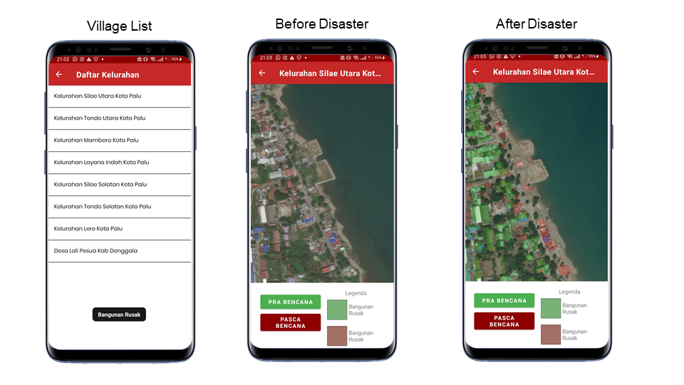
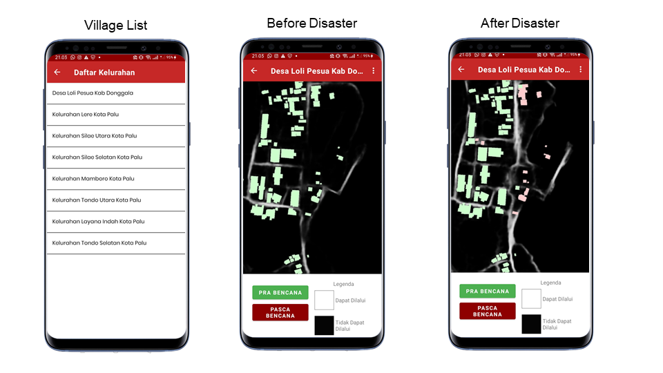
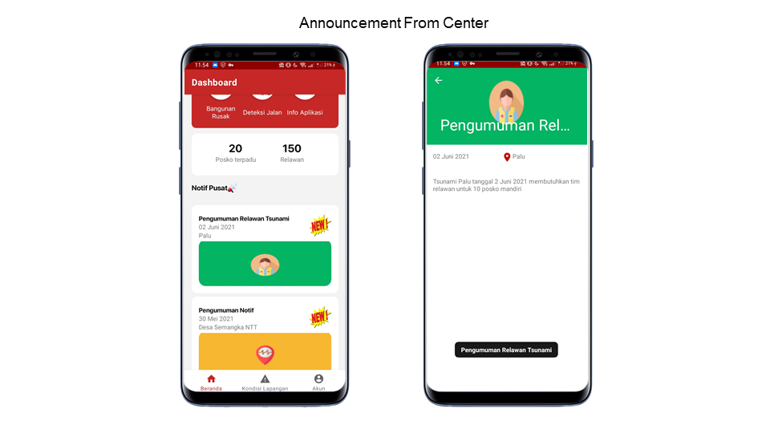
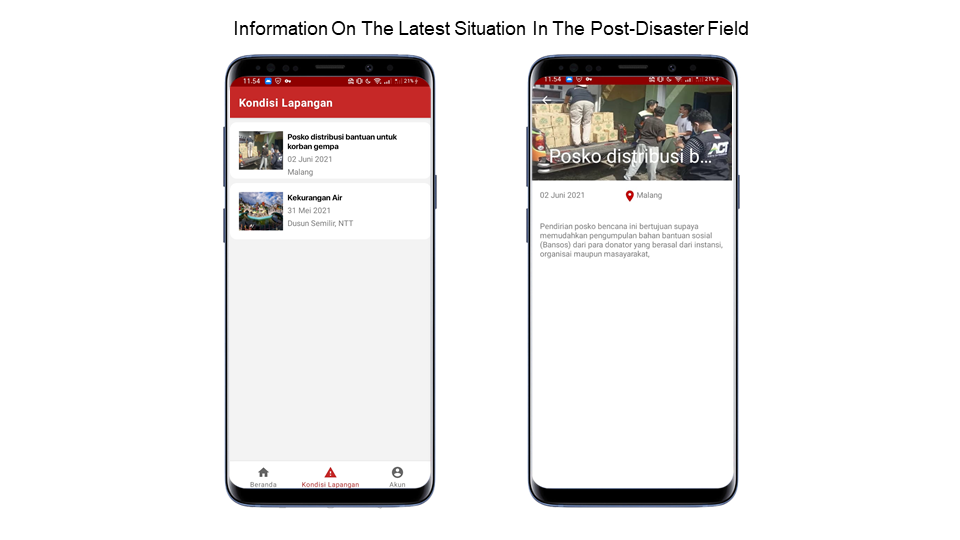
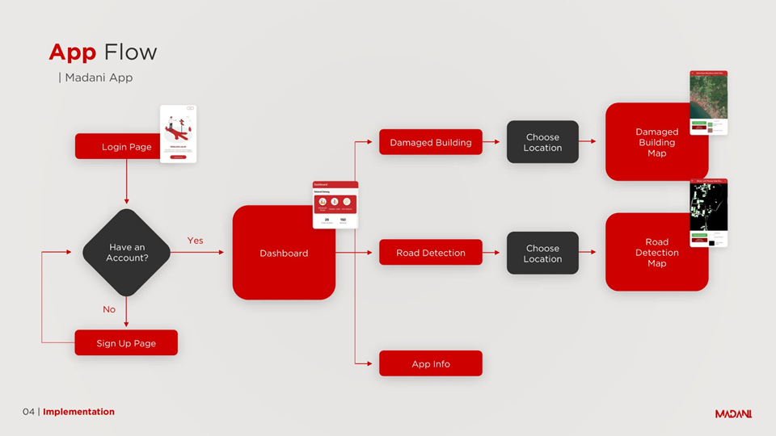

# MADANI: Mobile Development Path

MADANI is a user application that makes it easier for volunteers to carry out disaster mitigation by classifying routes and impact buildings based on post-disaster satellite images. equipped with a central notification containing updates on regional conditions with potential disasters and reinforcements.

## Feature

- Onboarding Screen

- Splash Screen

- Login

- Sign Up

- Detection Of Damaged Buildings After Disaster

- Post-Disaster Road Detection

- Announcement From Center

- Information On The Latest Situation In The Post-Disaster Field

## Application Flow

## Prototipe Application Using Adobe XD

## Built With

- [Adobe XD](https://www.adobe.com/products/xd.html)
- [Android Studio Native](https://developer.android.com/studio?gclid=Cj0KCQjwh_eFBhDZARIsALHjIKdN_DkjWIonOgxDbdueJpm-h_o4UVbMTdztmVgdcnxHzT1WV4vY3oYaAvcAEALw_wcB&gclsrc=aw.ds)
- [Retrofit 2](https://square.github.io/retrofit/)
- [Kotlin](https://kotlinlang.org)
- [Firebase Storage](https://firebase.google.com/docs/storage)
- [Firebase Firestore](https://firebase.google.com/docs/firestore)
- [REST API MADANI](https://mapping-area.dennyalfa.com/)

## Android Developer MADANI

| Name                     | ID Bangkit | Github                           |
| ------------------------ | ---------- | -------------------------------- |
| Moh Yusril Ihza Maulana  | A3322966   | https://github.com/yusrilihzaM   |
| Mercya Salsabillah Shani | A1801839   | https://github.com/MercyaShani99 |